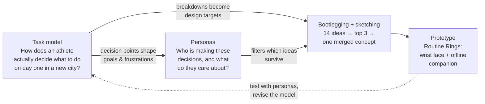

# Away Game

**An ongoing HCI design project: helping competitive athletes keep training, eating and sleeping well when they travel.**

Away Game is a personal project I'm building alongside my HCI course. Instead of treating each class method as a one off worksheet, I'm running them on a single real problem, in order so each method feeds the next. The repo holds the design documentation *and* a working prototype that came out of it.

> **Problem statement.** Competitive athletes lose training time, eat worse and recover poorly when they travel. In a new city they don't know where a usable gym is, what food they can trust and they're fighting jet lag, all while a coach back home is expecting them to hit the plan.

## Where the project is right now

| Phase | HCI method | Status | Document |
|---|---|---|---|
| 1 | Task modeling ( this I revised after feedback from a different model on a different project) | Done, v2 | [`docs/01-task-model.md`](docs/01-task-model.md) |
| 2 | Bootlegging & sketching | Done, round 2 convergence | [`docs/02-bootlegging-and-sketching.md`](docs/02-bootlegging-and-sketching.md) |
| 3 | Personas | Proto personas this does need validation | [`docs/03-personas.md`](docs/03-personas.md) |
| – | Design rationale (how 1–3 connect) | Living document | [`docs/04-design-rationale.md`](docs/04-design-rationale.md) |
| – | Working prototype | v0.1 | [`prototype/`](prototype/) |
| – | Process log | Ongoing | [`docs/process-log.md`](docs/process-log.md) |

## How the methods connect



The order in the course was task modeling → bootlegging → personas. In this project I let them loop: the personas were used to re-score the bootlegging ideas and the prototype is meant to be tested against the task model's breakdowns.

## Run the prototype

No build step, no dependencies.

```bash
cd prototype
python3 -m http.server 8000
# open http://localhost:8000
```

Or publish it with **GitHub Pages**: Settings → Pages → Deploy from a branch → `main` / `(root)`, then open `https://<your-username>.github.io/<repo-name>/prototype/`.

Try this path through it: leave the defaults (5h sleep, 5 time zones east), notice the verdict is a recovery day by the coach's rule, tap **Rested** on the wrist, turn on **Simulate no signal**, send the day summary, then turn signal back on and check the Coach tab.

The prototype works offline after the first load (service worker) because the biggest lesson from bootlegging was that wifi, roaming and battery fail exactly when an athlete is furthest from home so we should have def have something that doesn't always need connectivity. 

## Repo layout

```
├── README.md
├── docs/
│   ├── 01-task-model.md              # decision-focused task model (v2)
│   ├── 02-bootlegging-and-sketching.md
│   ├── 03-personas.md
│   ├── 04-design-rationale.md        # traceability: breakdown → persona → feature
│   ├── process-log.md                # dated entries, add one each session
│   ├── sketches/                     # new sketches for this project
│   └── original-work/                # scans of the in-class assignments
└── prototype/
    ├── index.html
    ├── styles.css
    ├── app.js                        # readiness logic, rings, places, passport, coach view
    ├── data.js                       # sample city, places, swaps (fictional)
    ├── sw.js                         # offline cache
    └── manifest.json
```

## Credits

In class work done with my recitation partner **Matthew Aldridge** (task modeling subject and bootlegging partner). Everything in `docs/original-work/` is the original assignment as submitted; everything else extends it.
