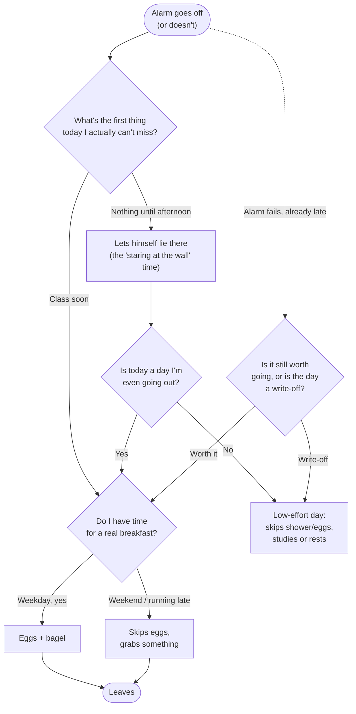
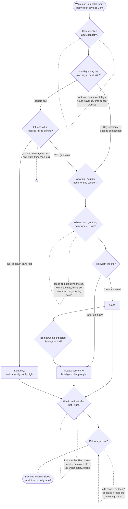

# 1 · Task model (v2): how a traveling athlete decides what to do on day one

## What changed from the class assignment

My in-class task models (the wake-up routine and the skincare routine, both of my partner Matthew) got this feedback:

> A task model is less about the action to do something, and more about the thinking/decision making process that led to an action. It is a human process, so it shouldn't be written like pseudocode for an algorithm since we are not computers. This is more of a user flow than a task model.

Looking back at v1 ([wake-up](original-work/task-model-wakeup-v1.jpg), [skincare](original-work/task-model-skincare-v1.jpg)), I can see exactly what they meant:

| v1 (what I drew) | Why it reads as a user flow | v2 (what a task model should capture) |
|---|---|---|
| `Shower → Shampoo → Conditioner → Body wash → Rinse and dry` | A fixed sequence of actions. No choice is being made, so there's nothing to learn about the person. | Collapse routine actions into one step. Spend the detail on the moments where he's *weighing* something. |
| `Alarm doesn't go off → Why? → volume too low / battery died / forgot to set it` | Debugging branches, like an `if/else` tree. A half-asleep person doesn't diagnose their phone first. | "I'm already late. Is it worth going to class at all, or is the day a write-off?" That judgment is the real decision. |
| `Sunscreen? → yes → apply → wait 15 min → go!` | Yes/no gates written like conditionals. | "Am I going to be outside enough today that it's worth waiting 15 minutes?" The *cue* (the weather, his schedule) and the *trade-off* (time vs. protection) are what matter. |
| Partner's notes: "stares at the wall," "may not leave every day" | These were the most human details, and I added them as side notes. | These should have been the center of the model: they show hesitation, energy, and motivation. |

**The main lesson:** a user flow answers *"what does the person do next?"* A task model answers *"what is the person trying to figure out, what do they look at to figure it out, and where does that thinking go wrong?"* The breakdowns in that thinking are where design opportunities come from.

### Quick redo: the wake-up routine as a decision model

To practice before applying it to the project, here's Matthew's morning rewritten around what he's thinking rather than what he's doing.



Showering and getting dressed disappear from the model entirely: they happen, but no decision is made there, so they don't tell a designer anything.

---

## The project task model

**Person:** a competitive athlete (see [personas](03-personas.md)).
**Top-level goal:** *"Don't lose ground while I'm away."*
**Situation modeled:** the first full day in an unfamiliar city, during a trip of 3–10 days, with a training plan set by a coach who is not there.

### Goal hierarchy

The athlete isn't running a checklist. They're juggling four goals that compete for the same limited energy and time.

```
0. Don't lose ground while I'm away
   1. Figure out whether my body is ready to train today
   2. Find somewhere to train that I trust enough to be worth the trip
   3. Eat in a way that won't wreck the session or my stomach
   4. Get my sleep back on track so tomorrow is better than today
   (throughout) Keep my coach confident that I'm handling it
```

Goal 1 gates everything else. If the athlete decides they're not ready, goals 2 and 3 change shape (a recovery walk and a light meal instead of a session and a pre-workout meal).

### Decision model



Dotted self-loops mark the **cues** the athlete gathers before deciding. The empty circle marks a decision that stalls: the athlete messages the coach and waits, and the answer often comes hours later because of the time difference.

### Decision-by-decision breakdown

| # | The question in their head | Cues they rely on | What they don't know | How they usually resolve it | Where it breaks down |
|---|---|---|---|---|---|
| D1 | "How wrecked am I, honestly?" | Hours slept, heavy legs, mood, travel hours | Whether tiredness is jet lag (passes) or real fatigue (doesn't) | Gut feel, often biased toward "I'm fine" | **B1.** No shared, trusted read on readiness; athletes over- or under-estimate |
| D2 | "Can I skip today?" | Training plan, days until competition | Whether the coach would actually mind | Asks coach; waits | **B2.** Coach is asleep or unreachable; decision stalls or athlete guesses |
| D3 | "Will resting feel like falling behind?" | Streaks, teammates' activity, self-image | Nothing. This is emotional, not informational | Trains anyway to avoid guilt | **B3.** Guilt drives the decision, not readiness |
| D4 | "Where can I train that I trust?" | Hotel gym photos, map reviews (from non-athletes), teammate tips | Real equipment, crowds, whether a day pass exists | Asks around; picks the closest option | **B4.** General reviews don't answer athlete questions ("is there a squat rack?") |
| D5 | "Is it worth the trip?" | Distance, transport, cost | Actual travel time in an unfamiliar city | Overestimates convenience, loses time | **B5.** Trade-off made on bad information |
| D6 | "Salvage or bail?" | What's actually there | How to adapt the session on the spot | Improvises or leaves | **B6.** No quick way to swap to an equivalent session |
| D7 | "What can I eat that I trust?" | Familiar chains, teammates, packaging | Ingredients, water safety, portion size | Eats familiar fast food, or undereats | **B7.** Safety and familiarity beat nutrition |
| D8 | "Did today count?" | How the session felt | Whether the coach would see it as a win | Stays quiet about bad days | **B8.** Coach loses visibility exactly when it matters |
| D9 | "Sleep on local time or body time?" | How tired they are, tomorrow's schedule | Best strategy for their direction of travel | Naps, then can't sleep at night | **B9.** Jet lag stretches out |
| – | (all of the above, abroad) | Phone, maps, messaging | – | – | **B10.** Roaming, wifi, or battery fail, and every cue above disappears at once |

### Design implications

Each breakdown becomes a design target. These carried directly into bootlegging round 2 and the prototype (full traceability in [`04-design-rationale.md`](04-design-rationale.md)).

- **B1, B3:** Give the athlete an honest, glanceable read on readiness that separates jet lag from fatigue, and make "rest" a *completed* ring, not a missed one, so rest stops feeling like failure.
- **B2, B8:** Let the coach set rules ahead of time ("if sleep < 6h, swap to recovery") so the athlete doesn't need a live answer, and share the day's outcome automatically.
- **B4, B5:** Places verified by athletes, answering athlete questions (racks, pool length, hours, day pass), with walking time from the hotel.
- **B6:** A one-tap "swap session" that suggests an equivalent workout for the equipment actually available.
- **B7:** Food spots filtered by trust signals, not ratings.
- **B9:** A simple plan for which direction to shift sleep.
- **B10:** Everything above has to work offline, and the core needs a no-tech fallback.

### Limits of this model and next steps

This model is built from my own reasoning, my bootlegging partner's review, and conversations in class, not from observing athletes on the road. Specifically, D3 (guilt) and D8 (staying quiet about bad days) are assumptions I think are true but haven't confirmed.

**Next step:** do 2–3 short interviews with athletes who travel for competition (campus club or varsity teams), walking through their last trip day by day, and revise this model. Log changes in [`process-log.md`](process-log.md).
