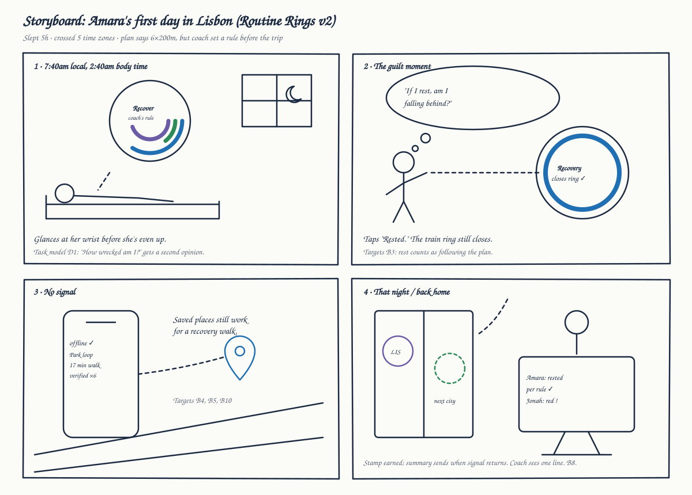

# 2 · Bootlegging and sketching

## Round 1: the in-class bootleg

With my partner Matthew Aldridge, we drew random cards from three decks and forced them together:

| Deck | Card drawn |
|---|---|
| Problem space | Travel |
| Target audience | Athletes |
| Unique interaction | Wrist-mounted |

The point of bootlegging is that the random constraint pushes you past the first obvious idea. "Travel + athletes" alone would have gotten us a gym-finder app. Adding "wrist-mounted" forced a harder question: *what does an athlete need at a glance, mid-trip, without pulling out a phone?*

Original sheets: [page 1](original-work/bootlegging-sheet-1.jpg), [page 2](original-work/bootlegging-sheet-2.jpg).

### The 14 ideas

| # | Idea | One-line description | Pick |
|---|---|---|---|
| 1 | Routine Rings | Three rings on the wrist: train, eat, sleep | ⭐ Top 3 |
| 2 | Drop-pin Gym Finder | Map of athlete-verified gyms, pools, clean-food spots near the team hotel | |
| 3 | Painted Route | AR glasses paint the day's run route onto a new city's streets | ✗ Lowest 3 |
| 4 | Hands-free Scheduler | Smart speaker that changes schedules on the go | ✗ Lowest 3 |
| 5 | Home-gym Anywhere | VR rebuilds your familiar home gym inside a hotel room | |
| 6 | Coach Command Center | Remote coach sees team health, location, and whether goals are met | ⭐ Top 3 |
| 7 | Team Bus Board | Shared team display turns routine into social competition | |
| 8 | Training Passport | Physical passport stamped at every gym; streaks and travel memento | ⭐ Top 3 |
| 9 | Voice in Your Ear | Spatial audio guide for navigation, pacing, hydration | ✗ Lowest 3 |
| 10 | Smart-bag Tag | Gear bag tracker tells you what you forgot (protein, creatine) | |
| 11 | Jet Lag Lamp | Ambient light that eases circadian rhythm | |
| 12 | One Card a Day | One card per day: what to eat, where to train | |
| 13 | Food/Water Rings | Hydration and food targets on rings attached to bottles and tiffins | |
| 14 | Hotel Door Hanger | Tells hotel staff to wake you for training | |

### What I concluded in class

- **#1 Routine Rings** won because the wrist is the one device an athlete already wears while training, so adoption costs nothing, and it covers all three parts of the problem in one glance.
- **#6 Coach Command Center** is the only idea that includes the coach, the person who can actually change the plan when readiness drops.
- **#8 Training Passport** works with zero technology, which matters in a country with poor connectivity or with a dead battery.
- **#3, #4, #9** were cut: AR glasses aren't something athletes carry yet, and talking to a device in a shared hotel room or a loud gym is awkward, with nothing to look back at later.
- **Surprise:** the low-tech ideas (#8, #12, #14) were the most reliable. Roaming, wifi, and battery all fail exactly when the athlete is furthest from home. Whatever gets built needs an offline fallback.

## Round 2: re-scoring with the task model and personas

This is where the project extends the class work. In class, we picked winners by gut feel. Here I re-scored the top ideas against the **breakdowns from the task model** ([B1–B10](01-task-model.md#decision-by-decision-breakdown)) and the **needs of the personas** ([Amara and Coach Reyes](03-personas.md)).

✓ = directly addresses it · ~ = partially · blank = no

| Breakdown | #1 Rings | #2 Pins | #6 Coach | #8 Passport | #11 Lamp | #12 Card | #13 Food rings |
|---|:-:|:-:|:-:|:-:|:-:|:-:|:-:|
| B1 no trusted readiness read | ✓ | | ~ | | | | |
| B2 coach unreachable | | | ✓ | | | | |
| B3 guilt drives decision | ✓ | | | ~ | | | |
| B4 reviews don't answer athlete questions | | ✓ | | | | ~ | |
| B5 bad trip trade-offs | | ✓ | | | | | |
| B6 can't adapt session on the spot | | | ~ | | | ✓ | |
| B7 food trust | | ~ | | | | ~ | ✓ |
| B8 coach loses visibility | ~ | | ✓ | | | | |
| B9 jet lag | ~ | | | | ✓ | | |
| B10 tech fails abroad | | | | ✓ | | ✓ | |
| **Serves Amara (athlete)** | ✓ | ✓ | ~ | ✓ | ~ | ✓ | ✓ |
| **Serves Coach Reyes** | ~ | | ✓ | | | | |

**What the grid showed me:** no single idea covers the breakdowns, but #1, #2, #6, and #8 together cover almost all of them, and they combine naturally: the rings are the *surface*, and the others are *layers* on it. This matches the "elements I could carry across" note I wrote in class, but now there's a reason for each merge rather than a hunch.

### The merged concept: Routine Rings v2

| Comes from | Becomes |
|---|---|
| #1 Routine Rings | The main watch face: train, eat, sleep |
| #1 + B3 | Resting on a recovery day *closes* the train ring. Rest counts |
| #6 Coach Command Center | Coach sets rules before the trip; athlete sees them as a readiness verdict. Day summary syncs when there's signal |
| #2 Drop-pin Finder | Athlete-verified places as a layer, answering athlete questions, with walking time from the hotel |
| #8 Training Passport | Stamps plus a streak; a printable paper passport is the offline fallback |
| #12 One Card a Day | The "today" card, including a swap-session option (B6) |
| #13 Food/water rings | Hydration folds into the eat ring instead of being its own device |

**Deliberately left out (for now):** #11 Jet Lag Lamp (addresses B9 well, but it's a separate device; I folded a simple sleep-shift tip into the watch instead), #7 Team Bus Board (interesting social angle, but it could make B3 guilt worse).

## Round 2 sketches

Sketching in this round was used to **communicate** the merged concept, not to generate ideas. The storyboard walks one persona through the task model's first day.

> **Note to self:** the storyboard above is a clean digital version so it renders on GitHub. The course emphasizes quick hand sketches, so the next entry in the process log should be a hand-drawn round of 6–8 thumbnail variations of the watch face alone (layout of rings, where the verdict goes, how a stamp appears), scanned into `docs/sketches/`.

## Reflection: what bootlegging and sketching taught me

1. **Random constraints did real work.** "Wrist-mounted" felt arbitrary, but it's the reason the final concept is glanceable instead of yet another app.
2. **Bootlegging is a divergence tool; it needs a convergence tool after it.** Picking the top 3 by instinct was fine in class, but the task-model grid made the merge defensible.
3. **Sketches had two jobs at two stages.** In round 1 they were for thinking (fast, messy, 14 of them). In round 2 they were for explaining one idea to someone else, so the storyboard shows a person, a place, and a moment, not just a UI.
